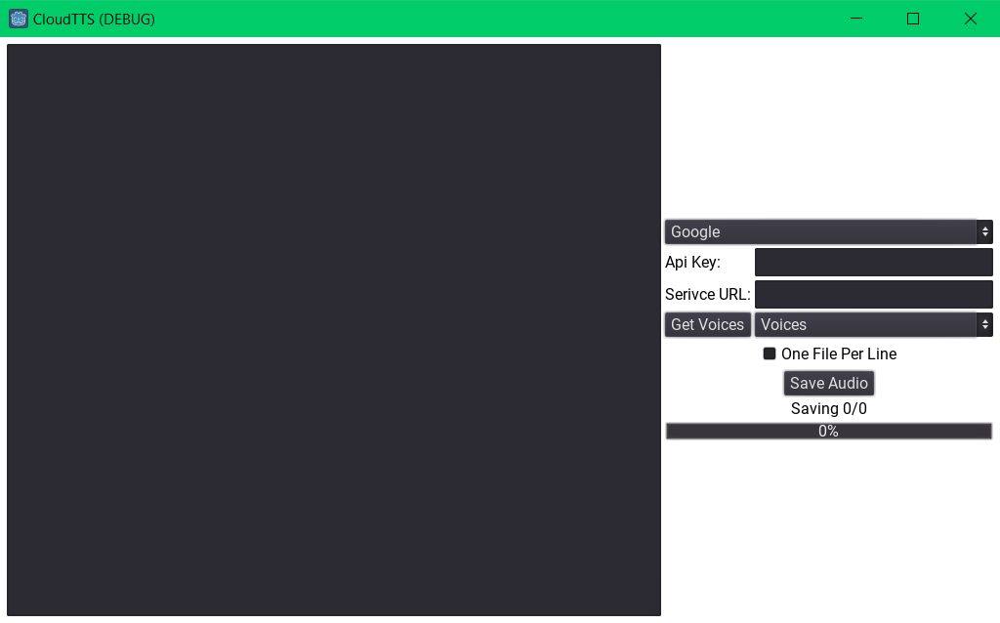

A basic utility for interfacing with Google Cloud TTS.

# Development
## Requirements
In order to develop and build this project from source, you'll need to complete the following steps:

1. Download Godot Engine 3.2 from [here](https://downloads.tuxfamily.org/godotengine/3.2.3/).
2. Import the project into Godot using the project viewer.
3. Finally, [install the build templates from the editor.](https://docs.godotengine.org/en/stable/getting_started/workflow/export/exporting_projects.html)

With these steps completed, you should now be ready to develop and export the application. If you unfamiliar with Godot and GDScript, please refer to the [documentation](https://docs.godotengine.org/en/stable/about/introduction.html).

## Adding A New API

In order to add a new API, implement the `TextToSpeechApi.gd` interface. Then add an instance of your API to the `api_list` in `Editor.gd`. For details about how an API should be implement, view the comments in `TextToSpeechApi.gd` and refer to the implementation of `GoogleTextToSpeechApi.gd`.